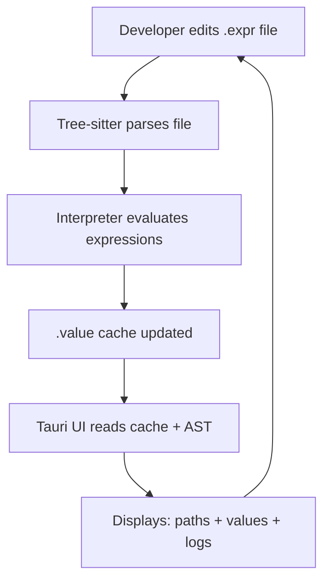

Here’s a **step-by-step implementation plan** for building an MVP of **Garden**—focusing on delivering early value, while laying a foundation for the full vision.

---

## 🌱 MVP Implementation Plan: “Tend Your Code”

### 🔹 GOAL:  
A developer writes expressions in `.expr` files.  
They see **live evaluated values** and **expression paths** in a **Tauri UI**, updated automatically as they edit the file.

---

## ✅ Phase 1: File-Based MVP

### 🧾 1. **Syntax & File Format**
- Choose `.expr` as the file extension.
- Design a simple, JSON-like or Rust-like expression syntax.
  - Example:
    ```expr
    let name = "karen"
    let age = 27
    name + " is " + age
    ```
- Each `let` becomes a path in the value tree.

---

### 🌳 2. **Tree-sitter Integration**
- Use [Tree-sitter](https://tree-sitter.github.io/tree-sitter/) to parse `.expr` files.
- Build a structural AST for each file.
- Assign **stable paths** to each node (e.g., `["root", "age"]`, `["root", "name_plus_age"]`).

---

### ⚙️ 3. **Interpreter Runtime**
- Write a naive interpreter in **Rust**:
  - Executes ASTs expression-by-expression.
  - Stores values per expression path (`.garden/cache/*.value`).
  - On error, store failure logs as part of the value object.

- Optional: support basic partial evaluation or memoization.

---

### 🖥️ 4. **File Watcher + Runtime Driver**
- Use `notify` (Rust crate) to **watch `.expr` files**.
- Re-interpret changed files and update `.value` cache.

---

## 🌼 Phase 2: Tauri UI

### 📊 5. **Visual Interface**
- Build a simple **Tauri app** that:
  - Lists all parsed files.
  - Shows each **expression path** and its live **value**.
  - Highlights **cache freshness** (e.g., stale, fresh, error).
  - On click: show raw expression, cached value, logs.

---

## 🛠️ Phase 3: Interactivity + Extras

### ✏️ 6. **Inline Editing or Expression Playground**
- Optional but powerful: allow editing expressions directly in the Tauri UI (projectional style).
- Or, have a “Playground” where you test expressions with live feedback.

---

### 🔌 7. **Babashka Pod Integration**
- Allow `.expr` expressions to call out to pods.
- Example: `"Hello, " + (pod.fetchUserName :id 42)`

---

## 🚀 Stretch Goals for v2

- Store expression history over time.
- Add a time-travel scrubber per value.
- Support expression diffs and “why did this value change?”
- Compose `.expr` files into modules (i.e., `garden/main.expr`, `garden/math.expr`)
- Hosted Garden with team collaboration and replayable logs.

---

## 🔁 Summary MVP Loop



---

## ✨ What You’ll Get in the MVP

- Reactive, file-based development.
- Every expression has a **live value** and **stable identity**.
- You can explore your code **like a data tree**, not a static script.
- It’s tangible, introspectable, and already more powerful than a REPL.

---

Would you like scaffolding code for:
- the file watcher?
- interpreter starter?
- Tree-sitter config?
- Tauri UI tree renderer?

Just say the word, and we can start growing 🌿
